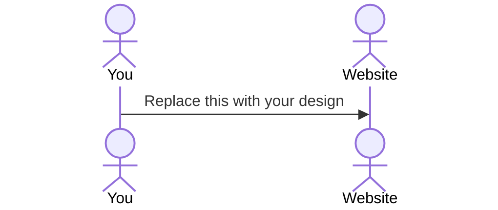

# German Noun Intuassist

[My Notes](notes.md)

One of the most common obstacles faced by English-speakers trying to learn German is developing an intuition for noun gender. Every German noun has an associated gender, and while there are some guiding patterns for learning them, there are almost as many exceptions. With German Noun Intuassist, users can rapidly practice guessing the gender of various German nouns, track their progress over time, and customize their learning until they reach the intuition they're looking for.

> [!NOTE]
>  This is a template for your startup application. You must modify this `README.md` file for each phase of your development. You only need to fill in the section for each deliverable when that deliverable is submitted in Canvas. Without completing the section for a deliverable, the TA will not know what to look for when grading your submission. Feel free to add additional information to each deliverable description, but make sure you at least have the list of rubric items and a description of what you did for each item.

> [!NOTE]
>  If you are not familiar with Markdown then you should review the [documentation](https://docs.github.com/en/get-started/writing-on-github/getting-started-with-writing-and-formatting-on-github/basic-writing-and-formatting-syntax) before continuing.

## 🚀 Specification Deliverable

> [!NOTE]
>  Fill in this sections as the submission artifact for this deliverable. You can refer to this [example](https://github.com/webprogramming260/startup-example/blob/main/README.md) for inspiration.

For this deliverable I did the following. I checked the box `[x]` and added a description for things I completed.

- [x] Proper use of Markdown
- [x] A concise and compelling elevator pitch
- [x] Description of key features
- [ ] Description of how you will use each technology
- [ ] One or more rough sketches of your application. Images must be embedded in this file using Markdown image references.

### Elevator pitch

Are you trying to learn German? Maybe you've gotten your conjugations down for some irregular verbs and are getting the hang of which prepositions go with which case. You might also be working on adjective endings, and discovering that they depend on knowing the gender of the noun they modify. (You were kind of hoping you wouldn't have to worry so much about those noun genders, right?) Well, I hate to break it to you, but while there's a ton of little patterns for guessing the gender of a noun, they've all got loads of exceptions, and you're probably better off developing an intuition for it through lots of trial and error. And you know what's kind of funny? There isn't a good website out there yet for practicing this sort of thing. That's where German Noun Intuassist comes in. With Intuassist, you can rapidly practice on a vast dataset of nouns customizable to your German-speaking level, celebrate your progress, and motivate other users to keep up the good work! Pretty soon, you'll find yourself forming German sentences without having to think twice about noun genders.

### Design

Lorem ipsum dolor sit amet, consectetur adipiscing elit, sed do eiusmod tempor incididunt ut labore et dolore magna aliqua. Ut enim ad minim veniam, quis nostrud exercitation ullamco laboris nisi ut aliquip ex ea commodo consequat. Duis aute irure dolor in reprehenderit in voluptate velit esse cillum dolore eu fugiat nulla pariatur. Excepteur sint occaecat cupidatat non proident, sunt in culpa qui officia deserunt mollit anim id est laborum.

### Key features

- Users can create an account or login to an existing one with an email address and corresponding password. Users can also create a username associated with their email address for logging in. Logging out also supported.
- While logged in or not, users can "Start Practicing." If not logged in, result history will not be tracked.
- Users can select a narrow dataset of common nouns for a beginner level, or increasingly wider datasets featuring less-common nouns for more advanced German learners.
- Link provided to open or collapse a list of patterns for guessing the gender of a noun.

### Technologies

I am going to use the required technologies in the following ways.

- **HTML** - Three HTML pages as follows: Home/practice page with list of patterns, sign up/login page, and a user profile and settings/progress page. Hyperlinks provided between pages as necessary.
- **CSS** - Simple but elegant design with sufficient contrast for functional buttons. Central presentation that fits to the space of the screen being used.
- **React** - Presents new nouns for user to practice on, handles opening and collapsing of patterns list, and stores data received from and to be sent to the server. Also handles login?
- **Service** - Backend endpoints for the following: login, retirieving a batch of nouns from a particular dataset, submitting a batch of practice statistics to be associated with a user.
- **DB/Login** - Stores users, with passwords encrypted. Also stores summary information about previous practice, such as total nouns attempted, accuracy, etc.
- **WebSocket** - Sends motivating notifications based on activity of other users, such as the following: "3 other users have practiced on 50+ nouns in the last hour!"

## 🚀 AWS deliverable

For this deliverable I did the following. I checked the box `[x]` and added a description for things I completed.

- [ ] **Server deployed and accessible with custom domain name** - [My server link](https://yourdomainnamehere.click).

## 🚀 HTML deliverable

For this deliverable I did the following. I checked the box `[x]` and added a description for things I completed.

- [ ] **HTML pages** - I did not complete this part of the deliverable.
- [ ] **Proper HTML element usage** - I did not complete this part of the deliverable.
- [ ] **Links** - I did not complete this part of the deliverable.
- [ ] **Text** - I did not complete this part of the deliverable.
- [ ] **3rd party API placeholder** - I did not complete this part of the deliverable.
- [ ] **Images** - I did not complete this part of the deliverable.
- [ ] **Login placeholder** - I did not complete this part of the deliverable.
- [ ] **DB data placeholder** - I did not complete this part of the deliverable.
- [ ] **WebSocket placeholder** - I did not complete this part of the deliverable.

## 🚀 CSS deliverable

For this deliverable I did the following. I checked the box `[x]` and added a description for things I completed.

- [ ] **Header, footer, and main content body** - I did not complete this part of the deliverable.
- [ ] **Navigation elements** - I did not complete this part of the deliverable.
- [ ] **Responsive to window resizing** - I did not complete this part of the deliverable.
- [ ] **Application elements** - I did not complete this part of the deliverable.
- [ ] **Application text content** - I did not complete this part of the deliverable.
- [ ] **Application images** - I did not complete this part of the deliverable.

## 🚀 React part 1: Routing deliverable

For this deliverable I did the following. I checked the box `[x]` and added a description for things I completed.

- [ ] **Bundled using Vite** - I did not complete this part of the deliverable.
- [ ] **Components** - I did not complete this part of the deliverable.
- [ ] **Router** - Routing between login and voting components.

## 🚀 React part 2: Reactivity

For this deliverable I did the following. I checked the box `[x]` and added a description for things I completed.

- [ ] **All functionality implemented or mocked out** - I did not complete this part of the deliverable.
- [ ] **Hooks** - I did not complete this part of the deliverable.

## 🚀 Service deliverable

For this deliverable I did the following. I checked the box `[x]` and added a description for things I completed.

- [ ] **Node.js/Express HTTP service** - I did not complete this part of the deliverable.
- [ ] **Static middleware for frontend** - I did not complete this part of the deliverable.
- [ ] **Calls to third party endpoints** - I did not complete this part of the deliverable.
- [ ] **Backend service endpoints** - I did not complete this part of the deliverable.
- [ ] **Frontend calls service endpoints** - I did not complete this part of the deliverable.

## 🚀 DB/Login deliverable

For this deliverable I did the following. I checked the box `[x]` and added a description for things I completed.

- [ ] **User registration** - I did not complete this part of the deliverable.
- [ ] **User login and logout** - I did not complete this part of the deliverable.
- [ ] **Stores data in MongoDB** - I did not complete this part of the deliverable.
- [ ] **Stores credentials in MongoDB** - I did not complete this part of the deliverable.
- [ ] **Restricts functionality based on authentication** - I did not complete this part of the deliverable.

## 🚀 WebSocket deliverable

For this deliverable I did the following. I checked the box `[x]` and added a description for things I completed.

- [ ] **Backend listens for WebSocket connection** - I did not complete this part of the deliverable.
- [ ] **Frontend makes WebSocket connection** - I did not complete this part of the deliverable.
- [ ] **Data sent over WebSocket connection** - I did not complete this part of the deliverable.
- [ ] **WebSocket data displayed** - I did not complete this part of the deliverable.
- [ ] **Application is fully functional** - I did not complete this part of the deliverable.
